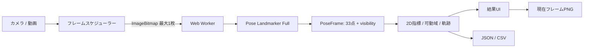

# MotionAnalysys

MotionAnalysysは、カメラ映像または手元の動画から、スポーツフォームの傾向を確認するためのブラウザアプリです。MediaPipe Pose Landmarker Fullで33点の姿勢ランドマークを推定し、関節角度、体幹・肩・腰の傾き、可動域、軌跡を表示します。

映像と分析結果はブラウザ内で処理し、クラウドへアップロードしません。アカウント登録やクラウド履歴もありません。初回表示時には、アプリ本体、WASM、姿勢推定モデルを同じサイトから取得します。MediaPipe runtimeに含まれる第三者向けメトリクス送信も、本番のContent Security Policyで遮断します。詳しくは[`/privacy`](app/privacy/page.tsx)に記録しています。

> [!IMPORTANT]
> 本アプリは医療機器・診断機器ではありません。表示する角度や位置は姿勢推定による目安です。単眼映像から得る3Dランドマークも、校正済み機器による実測の距離や奥行きではありません。

## v1の対象

- 1人だけが映るスポーツフォームの確認
- ライブカメラと端末内の動画ファイル
- 主要関節の2D角度、体幹傾斜、肩・腰の傾き、可動域
- 手首、足首、腰などの軌跡
- JSON、CSV、現在フレームのPNG書き出し
- 現行のChromeおよびSafari

複数人物の追跡、医療・リハビリ判断、校正済み3D計測、クラウド保存、ユーザーアカウント、スポーツ別の自動指導、分析済み動画の生成はv1の対象外です。

## 使い方

画面は次の4段階で進みます。

1. **撮影・動画選択**

   カメラを開始するか、端末内の対応動画を選びます。
2. **全身確認**

   頭から足先までが画面に入り、1人だけが十分な明るさで映っていることを確認します。
3. **解析**

   端末内で姿勢推定を行います。動画解析はキャンセルできます。
4. **結果**

   角度、傾き、可動域、最大・最小の時点、軌跡を確認し、必要に応じてJSON、CSV、PNGを書き出します。

## セットアップ

### 必要な環境

- Node.js 22以上
- npm
- カメラ利用時は、`localhost`またはHTTPSで配信されるページ

### 起動

```bash
git clone https://github.com/TakumaMaruyama/Motion-Analysys.git
cd Motion-Analysys
npm ci
npm run assets:prepare
npm run verify:model
npm run dev
```

ブラウザで <http://localhost:3000> を開きます。

E2Eテストを初めて実行する環境では、事前にPlaywrightのブラウザを用意してください。

```bash
npx playwright install
```

## コマンド

| コマンド | 内容 |
| --- | --- |
| `npm run assets:prepare` | 固定した公式配布元からモデルを取得し、利用するWASMをruntime packageから自己ホスト領域へ配置 |
| `npm run dev` | 開発サーバーをポート3000で起動 |
| `npm run build` | Sites／Cloudflare Workers向けの本番ビルド |
| `npm run start` | 本番ビルドをポート3000でローカル起動 |
| `npm run verify:model` | 同梱モデルのサイズ／SHA-256と、利用するmodule版WASM 2ファイルのruntime一致を検証 |
| `npm run typecheck` | TypeScriptの型検査 |
| `npm run lint` | ESLint |
| `npm run test` | 単体テスト |
| `npm run test:unit` | Vitestの単体テスト |
| `npm run test:e2e` | PlaywrightのE2Eテスト |
| `npm run audit:prod` | 本番依存のhigh／critical脆弱性を検査 |
| `npm run benchmark:check -- report.json` | 10動画のモデル比較とライブFPSの出荷基準を判定 |
| `npm run verify` | モデル、型、Lint、単体テスト、ビルドをまとめて検証 |

CIでは本番依存へ`npm run audit:prod`を実行し、high／criticalが検出されたリリースを止めます。
実機・代表動画が必要な確認手順と記録欄は[`docs/release-validation.md`](docs/release-validation.md)に分離しています。

## Sitesでの公開

本アプリはVinextを通してCloudflare Workers互換のESMへビルドされます。公開設定は[`.openai/hosting.json`](.openai/hosting.json)、Workerの入口は[`worker/index.ts`](worker/index.ts)です。永続ストレージは使用しないため、D1とR2のbindingはありません。

`npm run build`が成功すると、Sitesへ渡す`dist/server/index.js`と静的ファイルが生成されます。公開先はHTTPSになるためカメラを利用でき、モデル、WASM、動画解析は引き続き同一オリジンと利用者のブラウザ内だけで完結します。

## アーキテクチャ

推論、指標計算、表示、エクスポートを分離しています。動画のフル解像度フレームは履歴として保持せず、解析結果には33点のランドマークと算出した指標だけを残します。



主要な責務は次のとおりです。

- `components/analysis-workspace.tsx`：4段階の分析画面とフレームスケジューラー
- `app/page.tsx`：ホーム画面と分析UIの配置
- `workers/pose-estimator.worker.ts`：MediaPipeの初期化と推論
- `lib/pose/worker-estimator.ts`：UIからWorkerを使う`PoseEstimator`アダプター
- `lib/pose/metrics.ts`：関節角度、傾き、可動域、軌跡の純粋関数
- `lib/pose/export.ts`：`AnalysisResultV1`のJSON／CSV変換
- `types/analysis.ts`：33点ランドマーク、指標、出力スキーマ
- `public/models`、`public/mediapipe/wasm`：同一オリジンから配信するモデルとWASM

### フレーム処理

アップロード動画は、先頭から一定間隔のタイムスタンプを作り、**固定15Hz**でseekして解析します。同じ長さの動画に対して同じサンプル時刻を使用するため、端末の再生速度に左右されません。タイムスタンプ生成関数は、誤った高レート指定に備えて30Hzを安全上限としています。

ライブカメラは`requestVideoFrameCallback`で新しいフレームを受け取り、前の推論が完了している場合だけ次の`ImageBitmap`をWorkerへ転送します。転送待ちを含めても扱うフレームは常に最大1枚で、Workerは推論直後に`ImageBitmap.close()`を呼びます。そのため、raw frameの使用量が解析時間に比例して増えない設計です。

### 指標と信頼度

MediaPipe Pose Landmarker Fullが返す33点の画像座標とvisibilityを使用します。主要な数値は撮影面に対する2D角度から計算します。world landmarkは姿勢の向きを補助的に確認するための推定座標であり、cmやmの実測値としては扱いません。

指標に必要な点のうち、1点でも`visibility < 0.5`なら、その値を表示しません。内部では次の状態を区別します。

- `valid`：値を表示できる
- `low-confidence`：必要な点のvisibilityが閾値未満
- `unavailable`：点がない、座標が不正、角度を計算できない

低信頼度や計算不能の値を`0`として扱うことはありません。

## 出力

- **JSON**：`AnalysisResultV1`。入力情報、固定サンプルレート、モデルID・runtime version・モデルSHA-256、フレーム、指標、軌跡を含みます。
- **CSV**：ランドマーク、時系列指標、指標要約、軌跡要約をlong形式で出力します。表計算ソフト向けの数式注入対策を行います。
- **PNG**：現在表示している映像フレームと姿勢オーバーレイを保存します。

ファイルは利用者の操作によって端末へ保存されます。書き出したデータには姿勢情報が含まれるため、共有や保管は利用者自身で管理してください。

## モデル

本番では、公式のMediaPipe Pose Landmarker Fullを自己ホストして使用します。ビルド時に固定generationから取得してサイズとSHA-256を検証し、WASMも固定したruntime packageと一致するものだけを公開物へ配置します。実行時に外部CDNへのフォールバックはありません。

| 項目 | 値 |
| --- | --- |
| runtime | `@mediapipe/tasks-vision@1.0.0` |
| model | `pose_landmarker_full.task` |
| family | BlazePose GHUM 3D Full、float16 |
| size | `9,398,198` bytes |
| SHA-256 | `4eaa5eb7a98365221087693fcc286334cf0858e2eb6e15b506aa4a7ecdcec4ad` |
| 取得元 | [Google MediaPipe Models（GCS generation 1682642787774579）](https://storage.googleapis.com/mediapipe-models/pose_landmarker/pose_landmarker_full/float16/latest/pose_landmarker_full.task?generation=1682642787774579) |
| モデルカード | [BlazePose GHUM 3D Model Card](https://storage.googleapis.com/mediapipe-assets/Model%20Card%20BlazePose%20GHUM%203D.pdf) |
| ライセンス | Apache License 2.0 |

モデルファイルを変更するときは、ファイル本体、期待サイズ、SHA-256、モデルID、[`docs/model-sources.md`](docs/model-sources.md)、[`THIRD_PARTY_NOTICES.md`](THIRD_PARTY_NOTICES.md)を同時に更新してください。

### PINTO_model_zooとの関係

モデル選定では、[PINTO0309/PINTO_model_zoo](https://github.com/PINTO0309/PINTO_model_zoo)を調査資料として参照しました。同リポジトリのREADMEには、各モデルを使う前に対象フォルダ直下の`LICENSE`を読むこと、変換スクリプトのMITライセンスと変換元モデルのライセンスを分けて扱うことが明記されています。

MotionAnalysysは、その方針に従って`053_BlazePose`などを比較しましたが、本番にはGoogle公式のTask bundleを採用しています。**PINTO_model_zooのコード、変換スクリプト、変換済みモデル、サンプル、アーカイブは一切取り込んでいません。**

将来PINTO_model_zooの成果物を検討する場合は、トップREADMEだけで判断せず、対象フォルダの`LICENSE`と変換元リポジトリのライセンスを改めて確認します。詳細な選定記録は[`docs/model-sources.md`](docs/model-sources.md)にあります。

## 対応ブラウザ

v1の正式対象は、リリース時点の現行ChromeとSafariです。

- カメラ利用にはブラウザの許可が必要です。
- 動画形式を選択できても、ブラウザやOSのデコーダーが対応していなければ解析できません。
- iPhone／iPadを含むメモリの少ない端末では、長時間・高解像度動画のデコードが不安定になる場合があります。
- Firefoxや古いブラウザは、動作する場合でもv1の正式対象外です。

## 既知の制約

- 1画面につき1人用です。複数人が映ると、意図しない人物を追跡する場合があります。
- 頭が見えない、全身が画面に収まらない、人物が遠すぎる、暗い、速い、身体が重なるなどの条件では精度が下がります。
- 固定15Hzの動画解析では、15分の1秒より短い非常に速い変化を捉えられない場合があります。
- 2D角度は撮影方向の影響を受けます。比較するときは、カメラの位置、向き、高さ、距離をそろえてください。
- world landmarkは単眼推定です。実寸距離、高精度な奥行き、身体計測には使用できません。
- visibilityが0.5未満の点を必要とする数値は表示されないため、遮蔽が多い動画では結果が少なくなることがあります。
- 分析結果はページを閉じるまでの一時データです。後から再表示するクラウド履歴はありません。
- ライブ処理速度は端末性能、解像度、ブラウザに依存します。
- 本アプリだけでフォームの安全性、けがの危険、診断、治療効果を判断することはできません。

## プライバシーとライセンス

- `/privacy` — [プライバシーポリシーのソース](app/privacy/page.tsx)
- `/terms` — [利用規約のソース](app/terms/page.tsx)
- `/licenses` — [アプリ内ライセンス表示のソース](app/licenses/page.tsx)
- [`THIRD_PARTY_NOTICES.md`](THIRD_PARTY_NOTICES.md)
- [MediaPipe Apache License全文](public/licenses/mediapipe/APACHE-2.0.txt)

本リポジトリ独自コードのライセンスは、ルートに別途`LICENSE`が追加されるまで未指定です。第三者コンポーネントとモデルには、それぞれのライセンスが適用されます。
