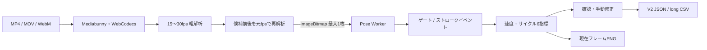

# MotionAnalysys

MotionAnalysysは、競泳の固定カメラ映像を端末内で計測する**無料ベータ版**のブラウザアプリです。利用者が端末から選んだ動画ファイルをMediaPipe Pose Landmarker Fullで処理し、自由形（クロール）、背泳ぎ、平泳ぎ、バタフライの4泳法について、姿勢ランドマークと参考計測値を表示します。ライブカメラ入力には対応していません。

動画と分析結果はブラウザ内で処理し、クラウドへアップロードしません。アカウント、クラウド履歴、外部LLM・生成AI、外部解析API、サーバー側推論はありません。撮影条件をそろえるための校正プロファイルだけをブラウザの`localStorage`に保存し、動画や分析履歴は保存しません。初回表示時には、アプリ本体、WASM、姿勢推定モデルを同じサイトから取得します。MediaPipe runtimeに含まれる第三者向けメトリクス送信も、本番のContent Security Policyで遮断します。詳しくは[`/privacy`](app/privacy/page.tsx)に記録しています。

> [!WARNING]
> 現在は検証中のベータ版です。80動画による検証と競泳現場でのパイロットは未実施で、スタート・ターン関連の検出と計測も検証未完了です。競技会の公式計時、順位・失格判定、医療・診断、けがの予測には使用しないでください。

> [!IMPORTANT]
> 表示値は単眼動画と姿勢推定から得る参考値です。校正プロファイルは撮影条件の再現と画面上の換算を補助するもので、校正済み計時装置、モーションキャプチャー、測量機器による実測を意味しません。

## 無料ベータ版の対象

- 利用者が端末から明示的に選択した動画ファイルのみ
- 位置・高さ・向きを変えない固定カメラで撮影した、1レーン・1人を基本とする映像
- 自由形（クロール）、背泳ぎ、平泳ぎ、バタフライの4泳法
- 区間タイム、平均速度、ストローク数、サイクル数、サイクルレート、1サイクル当たり距離
- 撮影条件を再利用する校正プロファイルの端末内保存
- JSON、CSV、現在フレームのPNG書き出し
- 自動結果を表示しない、2コーチ独立ラベル用の`/validation`画面
- 解析前のWebCodecs・Worker・WASMモデル・実動画1フレーム診断
- 1フレーム移動、タイムライン拡大、編集のUndo／Redo
- 現行のChromeおよびSafari

ライブカメラ、複数人物・複数レーンの追跡、公式計時・審判、医療・リハビリ判断、校正済み3D計測、クラウド保存、ユーザーアカウント、分析履歴、LLMによる自動指導、分析済み動画の生成は対象外です。

## 使い方

1. **動画選択**

   固定カメラで撮影した対応動画を端末から選びます。動画は本アプリのサーバーへ送信されません。
2. **モード・泳法・解析区間の設定**

   `Swim`と4泳法のいずれかを選び、最大30秒の解析区間を指定します。`Turn`と`Start`は検証中のため選択できません。
3. **距離ゲートの校正**

   映像上の既知距離へ2本のゲートを置きます。校正プロファイルは現在のブラウザにだけ保存でき、再利用時は必ず映像へ重ねて確認します。
4. **解析**

   端末内で姿勢推定、ゲート通過、ストローク候補を解析します。動画解析はキャンセルできます。
5. **確認・修正・保存**

   タイムライン上でゲート通過とストロークマーカーを追加・削除・移動し、1フレーム単位の確認とUndo／Redoを行えます。再計算後の結果をJSON、CSV、PNGで保存します。公式記録としては使用できません。

80動画検証の独立ラベルは`/validation`で作成できます。この画面は自動検出結果を表示せず、元動画名を含まない匿名JSONだけを利用者操作で保存します。計測可能な映像は既知距離とゲート／ストロークの実フレーム時刻を、無効・判定不能な映像は理由と`null`値を保存できます。

## セットアップ

### 必要な環境

- Node.js 22以上
- npm
- 現行のChromeまたはSafari

### 起動

```bash
git clone https://github.com/TakumaMaruyama/Motion-Analysys.git
cd Motion-Analysys
npm ci
npm run assets:prepare
npm run verify:model
npm run dev
```

ブラウザで <http://localhost:3000> を開きます。

E2Eテストを初めて実行する環境では、事前にPlaywrightのブラウザを用意してください。

```bash
npx playwright install
```

## コマンド

| コマンド | 内容 |
| --- | --- |
| `npm run assets:prepare` | 固定した公式配布元からモデルを取得し、利用するWASMをruntime packageから自己ホスト領域へ配置 |
| `npm run dev` | 開発サーバーをポート3000で起動 |
| `npm run build` | Sites／Cloudflare Workers向けの本番ビルド |
| `npm run start` | 本番ビルドをポート3000でローカル起動 |
| `npm run verify:model` | 同梱モデルのサイズ／SHA-256と、利用するmodule版WASM 2ファイルのruntime一致を検証 |
| `npm run typecheck` | TypeScriptの型検査 |
| `npm run lint` | ESLint |
| `npm run test` | 単体テスト |
| `npm run test:unit` | Vitestの単体テスト |
| `npm run test:e2e` | PlaywrightのE2Eテスト |
| `npm run audit:prod` | 本番依存のhigh／critical脆弱性を検査 |
| `npm run benchmark:check -- report.json` | 10動画のモデル比較とライブFPSの出荷基準を判定 |
| `npm run validation:swim -- manifest.json` | 外部80動画検証manifestを4泳法の公開基準で判定 |
| `npm run verify` | モデル、型、Lint、単体テスト、ビルドをまとめて検証 |

CIでは本番依存へ`npm run audit:prod`を実行し、high／criticalが検出されたリリースを止めます。
実機・代表動画が必要な確認手順と記録欄は[`docs/release-validation.md`](docs/release-validation.md)に分離しています。

## Sitesでの公開

本アプリはVinextを通してCloudflare Workers互換のESMへビルドされます。公開設定は[`.openai/hosting.json`](.openai/hosting.json)、Workerの入口は[`worker/index.ts`](worker/index.ts)です。アカウント、分析履歴、動画を保存するサーバー側ストレージは使用しないため、D1とR2のbindingはありません。

`npm run build`が成功すると、Sitesへ渡す`dist/server/index.js`と静的ファイルが生成されます。モデルとWASMは同一オリジンから取得し、選択した動画の解析は利用者のブラウザ内だけで完結します。

## アーキテクチャ

推論、指標計算、表示、エクスポートを分離しています。動画のフル解像度フレームは履歴として保持せず、解析結果には33点のランドマークと算出した指標だけを残します。



主要な責務は次のとおりです。

- `components/swim-analysis-workspace.tsx`：Swim計測、校正、イベント修正、出力UI
- `components/swim/analysis-adapter.ts`：動画デコード、姿勢推定、競泳計測の接続
- `app/page.tsx`：ホーム画面と分析UIの配置
- `workers/pose-estimator.worker.ts`：MediaPipeの初期化と推論
- `lib/pose/worker-estimator.ts`：UIからWorkerを使う`PoseEstimator`アダプター
- `lib/video/competition-frame-source.ts`：動画メタデータと表示時刻順の二段階フレーム取得
- `lib/swim`：4泳法ストローク、ゲート通過、手動修正、6指標、V2出力
- `types/analysis.ts`：互換用`AnalysisResultV1`と33点ランドマーク
- `types/competition.ts`：競泳用`CompetitionAnalysisResultV2`
- `public/models`、`public/mediapipe/wasm`：同一オリジンから配信するモデルとWASM

### フレーム処理

Mediabunnyの`VideoSampleSink`とWebCodecsを使い、コンテナに記録されたpresentation timestamp順でフレームを取得します。全区間を15〜30fpsで粗解析し、ゲート通過やストローク候補の前後だけを元fpsで再解析します。HTML動画要素を固定15Hzでseekする処理は精密解析に使用しません。

元動画から回転、解像度、実効fps、フレーム時刻、コーデック可否を確認します。WebCodecsまたはコーデックが利用できない場合はプレビューまでとし、精密解析は開始しません。1回のSwim解析区間は2〜30秒、30fps以上（60fps推奨）です。

無料ベータ版はライブカメラを入力として受け付けません。動画から生成した`ImageBitmap`は一度に最大1枚だけWorkerへ転送し、Workerは推論直後に`ImageBitmap.close()`を呼びます。そのため、raw frameの使用量が解析時間に比例して増えない設計です。

### 指標と信頼度

MediaPipe Pose Landmarker Fullが返す手首・肘・肩などの画像座標とvisibilityから、左右の交互性または同期性と周期間隔を検出します。絶対速度は既知のゲート間距離をゲート通過時間で割って求めます。world landmarkをcmやmへ換算しません。

イベント信頼度は次の状態を区別します。

- `confirmed`：0.8以上で自動確定
- `needs-review`：0.5以上0.8未満でコーチ確認が必要
- `unavailable`：0.5未満または算出不能で未計測
- `verified`：コーチがマーカーを追加・移動して確認済み

低信頼度や計算不能の値を`0`として扱うことはありません。

## 出力

- **JSON**：`CompetitionAnalysisResultV2`。入力、校正、品質、イベント、修正履歴、6指標、raw姿勢点を含みます。旧`AnalysisResultV1`も互換情報として保持します。
- **CSV**：`session_label, mode, stroke_style, record_type, key, value, unit, timestamp_ms, confidence, status, source`のlong形式です。表計算ソフト向けの数式注入対策を行います。
- **PNG**：現在表示している映像フレーム、ゲート、主要指標のサマリーを保存します。

ファイルは利用者の操作によって端末へ保存されます。書き出したデータには姿勢情報が含まれるため、共有や保管は利用者自身で管理してください。アプリ内に過去の分析を再表示する履歴機能はありません。

校正プロファイルはファイル出力とは別に、利用中のブラウザの`localStorage`へ保存されます。別の端末やブラウザとは同期されず、ブラウザのサイトデータを削除すると消去されます。

## モデル

本番では、公式のMediaPipe Pose Landmarker Fullを自己ホストして使用します。ビルド時に固定generationから取得してサイズとSHA-256を検証し、WASMも固定したruntime packageと一致するものだけを公開物へ配置します。実行時に外部CDNへのフォールバックはありません。

| 項目 | 値 |
| --- | --- |
| runtime | `@mediapipe/tasks-vision@1.0.0` |
| model | `pose_landmarker_full.task` |
| family | BlazePose GHUM 3D Full、float16 |
| size | `9,398,198` bytes |
| SHA-256 | `4eaa5eb7a98365221087693fcc286334cf0858e2eb6e15b506aa4a7ecdcec4ad` |
| 取得元 | [Google MediaPipe Models（GCS generation 1682642787774579）](https://storage.googleapis.com/mediapipe-models/pose_landmarker/pose_landmarker_full/float16/latest/pose_landmarker_full.task?generation=1682642787774579) |
| モデルカード | [BlazePose GHUM 3D Model Card](https://storage.googleapis.com/mediapipe-assets/Model%20Card%20BlazePose%20GHUM%203D.pdf) |
| ライセンス | Apache License 2.0 |

モデルファイルを変更するときは、ファイル本体、期待サイズ、SHA-256、モデルID、[`docs/model-sources.md`](docs/model-sources.md)、[`THIRD_PARTY_NOTICES.md`](THIRD_PARTY_NOTICES.md)を同時に更新してください。

### PINTO_model_zooとの関係

モデル選定では、[PINTO0309/PINTO_model_zoo](https://github.com/PINTO0309/PINTO_model_zoo)を調査資料として参照しました。同リポジトリのREADMEには、各モデルを使う前に対象フォルダ直下の`LICENSE`を読むこと、変換スクリプトのMITライセンスと変換元モデルのライセンスを分けて扱うことが明記されています。

MotionAnalysysは、その方針に従って`053_BlazePose`などを比較しましたが、本番にはGoogle公式のTask bundleを採用しています。**PINTO_model_zooのコード、変換スクリプト、変換済みモデル、サンプル、アーカイブは一切取り込んでいません。**

将来PINTO_model_zooの成果物を検討する場合は、トップREADMEだけで判断せず、対象フォルダの`LICENSE`と変換元リポジトリのライセンスを改めて確認します。詳細な選定記録は[`docs/model-sources.md`](docs/model-sources.md)にあります。

## 対応ブラウザ

無料ベータ版の対象は、リリース時点の現行ChromeとSafariです。

- 動画形式を選択できても、ブラウザやOSのデコーダーが対応していなければ解析できません。
- iPhone／iPadを含むメモリの少ない端末では、長時間・高解像度動画のデコードが不安定になる場合があります。
- Firefoxや古いブラウザは、動作する場合でも無料ベータ版の対象外です。

## 既知の制約

- 固定カメラで撮影した1レーン・1人の動画を基本とします。平行移動・ズーム・回転を検出した場合、または背景情報が不足して固定状態を判定できない場合は精密解析を停止します。
- 水面反射、水しぶき、潜水、レーンロープ、他の泳者による遮蔽、人物が遠い・小さいなどの条件では姿勢推定の精度が下がります。
- 30fps未満、またはブラウザがデコードできないコーデックでは精密解析を実行しません。
- スタートとターンに関する検出・計測は検証中です。公式のスタート反応時間、タッチ、リレー引継ぎ、失格判定には使用できません。
- 2D角度は撮影方向の影響を受けます。比較するときは、カメラの位置、向き、高さ、距離をそろえてください。
- world landmarkは単眼推定です。実寸距離、高精度な奥行き、身体計測には使用できません。
- visibilityが0.5未満の点を必要とする数値は表示されないため、遮蔽が多い動画では結果が少なくなることがあります。
- 分析結果はページを閉じるまでの一時データです。後から再表示するクラウド履歴はありません。
- 校正プロファイルだけはブラウザの`localStorage`に残ります。共有端末では、必要に応じてサイトデータを削除してください。
- 解析速度は端末性能、解像度、動画の長さ、ブラウザに依存します。
- 本アプリだけでフォームの安全性、けがの危険、診断、治療効果を判断することはできません。

## ベータ検証の状態

2026年8月1日時点で、80動画の競泳検証ゲート、スタート・ターンの専用検証、コーチ・選手による現場パイロットはいずれも未完了です。自動テストや汎用姿勢モデルの再現性確認に合格しても、競泳計測の妥当性を証明したことにはなりません。検証項目と記録欄は[`docs/release-validation.md`](docs/release-validation.md)にあります。

## プライバシーとライセンス

- `/privacy` — [プライバシーポリシーのソース](app/privacy/page.tsx)
- `/terms` — [利用規約のソース](app/terms/page.tsx)
- `/licenses` — [アプリ内ライセンス表示のソース](app/licenses/page.tsx)
- [`THIRD_PARTY_NOTICES.md`](THIRD_PARTY_NOTICES.md)
- [MediaPipe Apache License全文](public/licenses/mediapipe/APACHE-2.0.txt)
- [Mediabunny MPL-2.0全文](public/licenses/mediabunny/MPL-2.0.txt)

本リポジトリ独自コードのライセンスは、ルートに別途`LICENSE`が追加されるまで未指定です。第三者コンポーネントとモデルには、それぞれのライセンスが適用されます。
